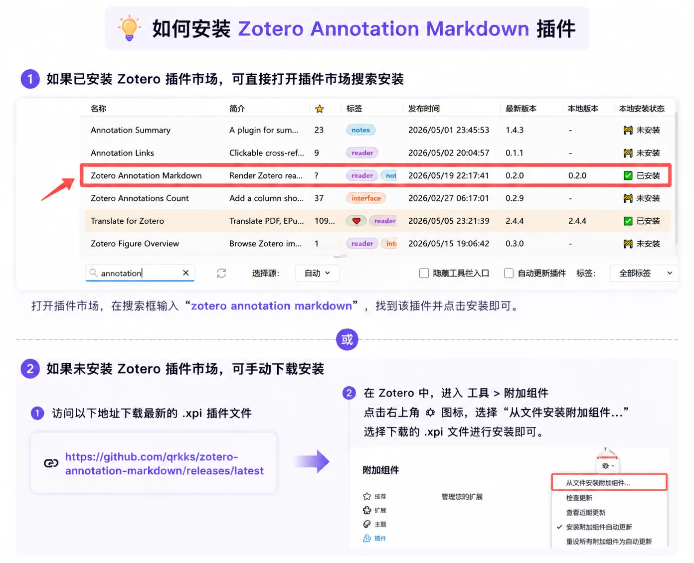

# Zotero Annotation Markdown

<p align="center">
  
</p>

[English](README.md) | 简体中文

Zotero Annotation Markdown 是一个 Zotero 插件，用来把 Zotero 阅读器侧栏里的批注评论渲染为 Markdown 和 LaTeX 数学公式，同时不改变 Zotero 实际保存的批注原文。

## 功能预览

<p align="center">
  
</p>

## 适用版本

- 优先支持 Zotero Desktop 9.0.3。
- 当前发布版声明兼容 Zotero 9.0.x。
- Windows 是当前主要开发和验证环境。

## 功能

- PDF 和 EPUB 阅读器侧栏里的批注评论默认按 Markdown 渲染。
- LaTeX 数学公式默认启用，支持 `$...$`、`$$...$$`、`\(...\)` 和 `\[...\]` 分隔符。
- 单个换行会保留为可见换行。
- 编辑批注时显示原始 Markdown 文本。
- 不信任原始 HTML，渲染内容会经过清理。
- 如果 Markdown 渲染失败，会保留原始纯文本显示。

## 安装

推荐在 Zotero 插件市场中搜索 `Zotero Annotation Markdown` 并安装。

也可以从最新 GitHub Release 手动下载 `zotero-annotation-markdown.xpi`：

```text
https://github.com/qrkks/zotero-annotation-markdown/releases/latest
```

在 Zotero 中打开 `工具 -> 插件`，然后把 `.xpi` 文件拖入插件窗口安装。

<p align="center">
  
</p>

## 设置

打开 Zotero 设置，选择 Annotation Markdown 面板，可以启用或关闭 Markdown 渲染、LaTeX 数学公式渲染，并把阅读器预览字号调整为 80% 到 150%。

<p align="center">
  
</p>

## 使用状态

<details>
<summary>查看渲染、编辑和折叠状态截图</summary>

### 聚焦状态（渲染）

<p align="center">
  
</p>

### 编辑状态（源码）

<p align="center">
  
</p>

### 失焦状态（折叠）

<p align="center">
  
</p>

</details>

## 开发

```powershell
npm install
npm test
npm run build
npm run package
```

打包后的插件文件会生成在：

```text
dist/zotero-annotation-markdown.xpi
```

## 发布

1. 更新 `package.json`、`package-lock.json` 和 `addon/manifest.json` 中的版本号。
2. 运行 `npm run verify`。
3. 在 GitHub 创建名为 `v<version>` 的 Release，并上传 `dist/zotero-annotation-markdown.xpi`。
4. 提交并推送自动生成的 `updates.json`，这样 Zotero 才能发现新版本。

插件更新清单地址：

```text
https://raw.githubusercontent.com/qrkks/zotero-annotation-markdown/main/updates.json
```

## 当前限制

核心渲染、设置、DOM 适配、阅读器生命周期和打包流程已有本地测试覆盖。Zotero 阅读器侧栏 DOM 不是完全稳定的公开 API，因此后续 Zotero 9.x 小版本更新后，仍建议重新做一次真实 Zotero 环境验证。
