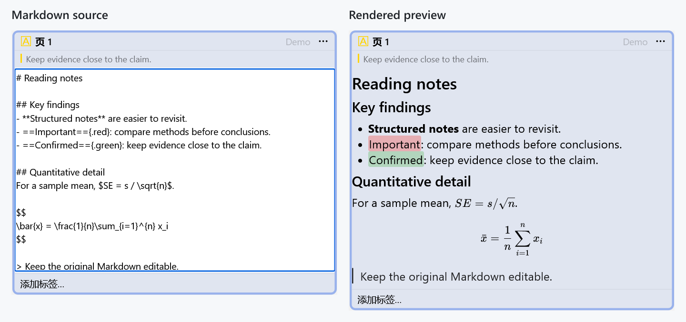
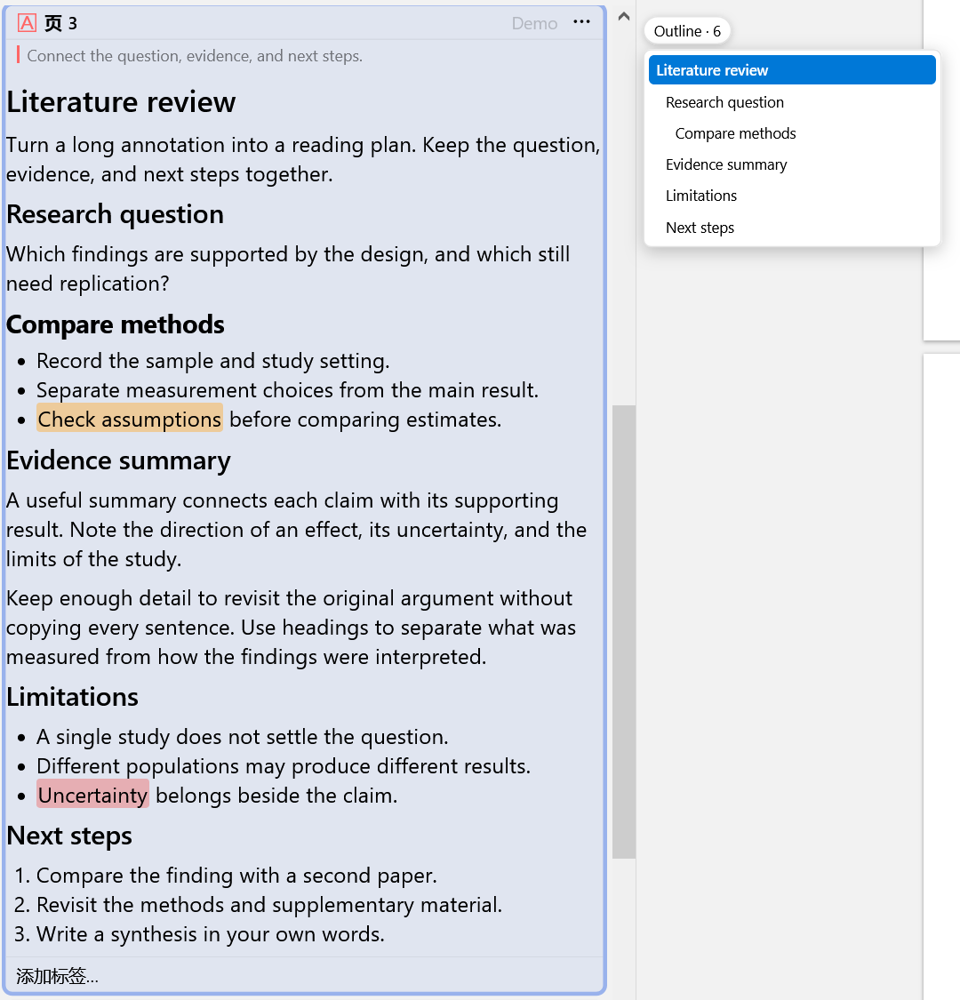
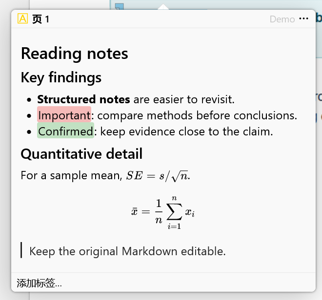

# Zotero Annotation Markdown

<p align="center">
  
</p>

<p align="center">
  <a href="https://github.com/qrkks/zotero-annotation-markdown/releases/latest"></a>
  <a href="https://github.com/qrkks/zotero-annotation-markdown/releases/latest"></a>
  <a href="https://github.com/qrkks/zotero-annotation-markdown/actions/workflows/ci.yml"></a>
  <a href="docs/zh-CN/user-guide.md#兼容性"></a>
  <a href="LICENSE"></a>
</p>

[English](README.md) | 简体中文

用 Markdown 标题、列表、彩色高亮和 LaTeX 公式，让 Zotero 标注评论更清晰易读。渲染时保留 Zotero 保存的标注原文，源码仍可继续编辑。

## 功能预览



**左侧**：编辑 Markdown 源码。**右侧**：阅读排版后的预览。离开编辑器或按 **Esc** 即可保存并返回预览。

| 浮动大纲 | 页内标注弹窗 |
| --- | --- |
|  |  |
| 点击大纲条目，直接跳转到标注侧栏内的对应章节。 | 在设置中开启 **Render page annotation popups as Markdown** 即可使用；该选项默认关闭。 |

截图使用演示文本，取自 Zotero 10.0.5 与 Annotation Markdown v0.11.0，预览字号设为 125%。

## 主要功能

- 在 PDF 和 EPUB 阅读器标注侧栏中预览 Markdown 与 LaTeX 数学公式。
- 可选择原生 MathML 渲染，作为默认关闭的实验选项。在设置的 **Math rendering** 中选择 **Native MathML (Experimental)**，可降低公式渲染开销，但公式间距和外观可能有所不同。
- 可选择在页内标注弹窗中启用 Markdown 预览（默认关闭）；快速编辑由独立偏好控制，并可回退 Zotero 原生行为。
- 沿用 markdown-it 生态的高亮语法：通过 [markdown-it-mark](https://github.com/markdown-it/markdown-it-mark) 支持 `==高亮文字==`；`==高亮文字=={.red}` 等颜色后缀沿用 [markdown-it-attrs](https://github.com/arve0/markdown-it-attrs) 的属性写法，并限定为安全的预设颜色。
- 在渲染预览中自动把裸 URL 转为可点击链接。
- 为包含多个标题的长标注提供可调文字大小的浮动大纲，方便持续导航。
- 可按标注评论中的 `todo:` 或 `t:` 行自动添加 `todo` 标签。
- 使用[快速源码编辑器](docs/zh-CN/user-guide.md#为什么替代编辑器可以更快)，在侧栏标签很多的书籍中仍能保持响应速度。
- 可以调整预览字号和标注渲染策略。
- 可在 Zotero 10.0.3 中实验性加速超大标注列表取消标签筛选后的恢复；默认关闭。
- 渲染内容经过清理，渲染失败时保留纯文本。
- 支持 Zotero Desktop 9.0 和 10.0.x。本版优先在 Zotero 10 上验证；Zotero 9 无法使用快速编辑能力时会自动回退原生编辑器。

## 安装

推荐在 Zotero 插件市场中搜索 `Zotero Annotation Markdown` 并安装。

也可以从[最新 GitHub Release](https://github.com/qrkks/zotero-annotation-markdown/releases/latest)下载 `zotero-annotation-markdown.xpi`。在 Zotero 中打开 **工具 → 插件**，然后把 `.xpi` 文件拖入插件窗口。

## 文档

- [使用指南](docs/zh-CN/user-guide.md)
- [架构与文件职责](docs/zh-CN/architecture.md)
- [开发与发布](docs/zh-CN/development.md)
- [性能诊断](docs/zh-CN/performance-diagnostics.md)
- [文档索引与翻译规则](docs/README.md)

## 快速开发

```powershell
pnpm install
pnpm test
pnpm run build
pnpm run package
```

打包后的插件位于 `dist/zotero-annotation-markdown.xpi`。

## 许可证

[MIT](LICENSE)
