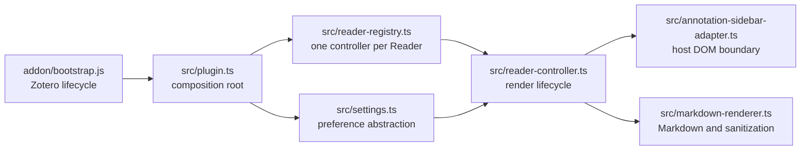

# Architecture and file map

[简体中文](../zh-CN/architecture.md)

This page describes the current repository and its active development boundaries.

## Runtime flow



`addon/bootstrap.js` is executed directly by Zotero. It loads the bundled `plugin.js`, registers the preference pane, injects the stylesheet text, and owns diagnostic-log setup. `src/plugin.ts` is the composition root: it connects Zotero APIs to settings, rendering, DOM adaptation, the per-Reader controller, and the registry.

The controller discovers annotation comments and decides when to render them. The adapter is the only module that should manipulate Zotero's annotation DOM. The renderer accepts text and returns sanitized HTML; it does not know about Reader nodes or preferences.

## Runtime invariants

- Zotero's original annotation source remains in the host DOM. The plugin adds a marked sibling preview and removes its own nodes during shutdown.
- Rendering pauses while an annotation editor owns focus. After editing, only the edited comment is forced through the immediate render path.
- Each open Reader has at most one controller. Registration and shutdown remain safe when startup is asynchronous.
- Raw Markdown HTML is disabled, and DOMPurify is the final boundary for generated HTML.
- Lazy rendering limits viewport and idle-time work. Performance diagnostics remain opt-in.
- Shutdown is best-effort per operation and per Reader root because closed Zotero windows can expose dead host objects.

## Source files

| File | Responsibility |
| --- | --- |
| `src/plugin.ts` | Plugin composition root and Zotero startup/shutdown integration. Registers Reader events and preference observers. |
| `src/reader-registry.ts` | Owns one controller per Reader, deduplicates registration, and coordinates asynchronous start/stop. |
| `src/reader-controller.ts` | Orchestrates Reader readiness, DOM discovery, eager/lazy rendering, editing pauses, caches, diagnostics, styles, and cleanup. |
| `src/annotation-sidebar-adapter.ts` | Encapsulates Zotero Reader selectors and source-plus-preview DOM operations. Excludes native note editors. |
| `src/markdown-renderer.ts` | Normalizes annotation text, renders Markdown and optional math, sanitizes output, and provides a plain-text fallback. |
| `src/settings.ts` | Defines preference keys, defaults, normalization, and the settings API consumed by runtime modules. |
| `src/types.ts` | Holds small shared contracts that do not depend on Zotero's host-specific object shapes. |
| `src/markdown-it-texmath.d.ts` | Supplies the minimal local TypeScript declaration required by `markdown-it-texmath`. |

Host-specific Zotero shapes should stay close to the boundary that consumes them, rather than becoming broad global types.

## Add-on files

| File | Responsibility |
| --- | --- |
| `addon/bootstrap.js` | Direct Zotero lifecycle entry point. Loads the bundle, registers preferences, reads CSS, and rotates diagnostics. |
| `addon/manifest.json` | Add-on identity, version, Zotero compatibility, icons, and update URL. |
| `addon/prefs.js` | Default preference values loaded by Zotero. |
| `addon/preferences.xhtml` | Preference-pane markup. |
| `addon/preferences.js` | Preference-pane event handling and writes to `Zotero.Prefs`. |
| `addon/preferences.css` | Preference-pane layout styles. |
| `addon/styles/annotation-markdown.css` | Reader preview, folding, editing, link, code, and content-visibility styles. |
| `addon/icons/annotation-markdown.svg` | Add-on and preference-pane icon. |

These JavaScript files intentionally remain JavaScript because Zotero executes them directly. TypeScript under `src/` is bundled into `dist/addon/plugin.js`.

## Build and maintenance scripts

| File | Responsibility |
| --- | --- |
| `scripts/build.mjs` | Copies `addon/`, bundles `src/plugin.ts`, and prepares add-on CSS and KaTeX assets. |
| `scripts/katex-assets.mjs` | Inlines KaTeX WOFF2 font data referenced by generated CSS. |
| `scripts/package.mjs` | Creates a deterministic XPI and generates local update metadata. |
| `scripts/release-config.mjs` | Centralizes release asset naming, update URLs, deterministic ZIP metadata, and update-manifest construction. |
| `scripts/check-docs.mjs` | Enforces paired English/Chinese pages and validates local Markdown links. |
| `scripts/read-debug-log.mjs` | Reads the opt-in annotation Markdown diagnostic log from a Zotero profile. |

`pnpm run package` rewrites `updates.json` for the locally built XPI. Keep that generated hash only for an actual release; otherwise restore the published release metadata.

## Tests

| Test file | Primary coverage |
| --- | --- |
| `tests/plugin.test.js` | Plugin composition, Reader events, preferences, and shutdown. |
| `tests/reader-registry.test.js` | Controller ownership and asynchronous lifecycle ordering. |
| `tests/reader-controller.test.js` | Rendering strategies, observers, editing pauses, caches, diagnostics, and cleanup. |
| `tests/annotation-sidebar-adapter.test.js` | Zotero DOM selection, source extraction, preview/edit behavior, and stale-state cleanup. |
| `tests/markdown-renderer.test.js` | Markdown, math, sanitization, normalization, and fallback behavior. |
| `tests/settings.test.js` | Preference defaults and normalization. |
| `tests/bootstrap.test.js` | Zotero bootstrap integration and diagnostics. |
| `tests/preferences-pane.test.js` | Preference-pane bindings. |
| `tests/rendered-content-style.test.js` | Preview folding, editing, and performance-related CSS. |
| `tests/katex-assets.test.js` | KaTeX font inlining. |
| `tests/release-config.test.js` | Update-manifest and deterministic-package configuration. |
| `tests/manifest.test.js` | Manifest identity and compatibility. |
| `tests/version.test.js` | Version consistency across release files. |

Tests remain JavaScript so the runtime-facing TypeScript contracts can be exercised with lightweight partial Zotero mocks.

## Build output

`pnpm run build` creates `dist/addon/` and bundles the TypeScript graph as `dist/addon/plugin.js`. `pnpm run package` creates `dist/zotero-annotation-markdown.xpi`. The `dist/` directory is generated output; edit `src/`, `addon/`, or `scripts/` instead.

Run the full verification pipeline before publishing:

```powershell
pnpm run verify
```
