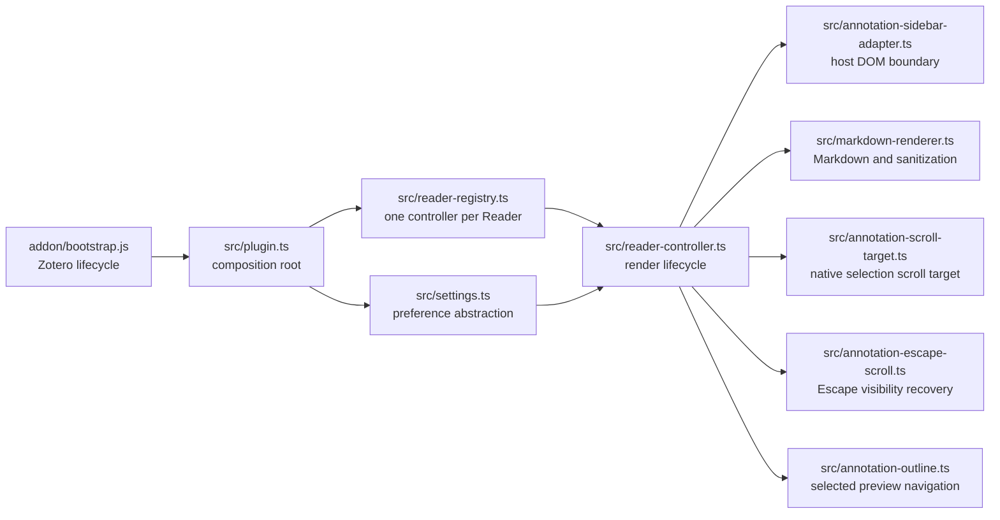
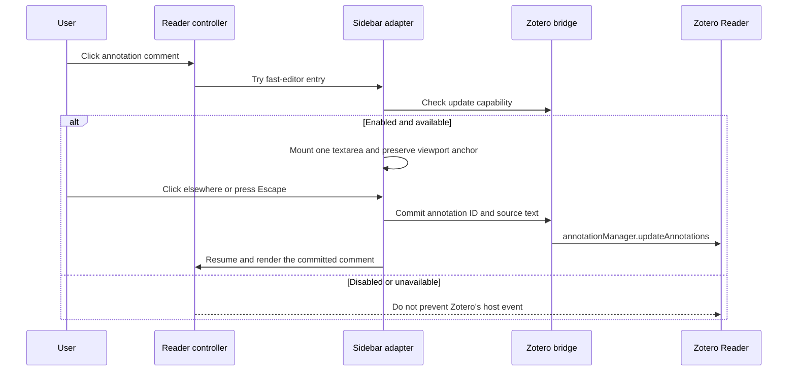

# Architecture and file map

[简体中文](../zh-CN/architecture.md)

This page describes the current repository and its active development boundaries.

## Runtime flow



`addon/bootstrap.js` is executed directly by Zotero. It loads the bundled `plugin.js`, registers the preference pane, injects the stylesheet text, and owns diagnostic-log setup. `src/plugin.ts` is the composition root: it connects Zotero APIs to settings, rendering, DOM adaptation, the per-Reader controller, and the registry.

The controller discovers annotation comments and decides when to render them. The adapter owns source, preview, and editor DOM operations. Scoped Reader helpers manage selection-target CSS, visibility recovery after Escape, and the selected preview's removable outline without replacing the host's annotation structure or native DOM methods. The renderer accepts text and returns sanitized HTML; it does not know about Reader nodes or preferences.

## Fast editor flow

The fast editor replaces Zotero's native annotation comment editor only when the preference is enabled and the current Reader exposes a callable annotation update manager:



`src/plugin.ts` is the host bridge for the semi-internal annotation manager and the optional deletion-key guard. `src/reader-controller.ts` coordinates captured entry and exit events without owning editor DOM. `src/annotation-sidebar-adapter.ts` owns the textarea, draft session, save-on-blur/Escape lifecycle, viewport anchoring, and cleanup. If the update capability is absent, the adapter does not mount the fast editor or prevent Zotero's event.

## Performance rationale and limits

The observed problem is workload-dependent: a real heavily annotated book became much slower to edit when Zotero's native editor was used, and the same book became responsive when the replacement editor was enabled. The slowdown correlated with a sidebar containing many annotation rows and tags. That A/B result justifies bypassing the native editing UI, but it does not establish tags as the sole cause or identify an exact bottleneck inside Zotero.

The replacement reduces work on the typing path by keeping one plain textarea session, leaving unrelated preview DOM mounted, pausing plugin rendering observers, and committing only the final source on blur or Escape. Persistence still calls the same Reader annotation manager used by Zotero; after a successful commit, the controller reconciles and renders only the affected comment. Editor-entry anchoring compensates for layout movement while opening an already-visible editor. Escape separately suspends browser scroll anchoring during preview restoration and recovers only a completely offscreen annotation.

This optimization does not replace Zotero's annotation storage, speed up tag management generally, or change the PDF page renderer. It depends on semi-internal Reader integration and therefore retains both capability detection and a user-controlled native-editor fallback.

## Fast editor implementation map

| Concern | Primary symbols | Contract |
| --- | --- | --- |
| Host capability and persistence | `canUseReaderFastEditor()`, `commitReaderAnnotationComment()` in `src/plugin.ts` | Detect a callable Reader annotation manager before takeover, clone cross-compartment update data when required, and return failure without discarding the draft. |
| Reader keyboard safety | `beginReaderFastEditorKeyboardGuard()` in `src/plugin.ts` and captured editor events in the adapter | Temporarily disable Zotero's empty-comment deletion shortcut when available and keep text-editing keys from reaching Reader-level handlers. |
| Entry and exit coordination | `registerFastEditorHandlers()`, `scheduleFastEditorAfterNativeFocus()`, `scheduleEditingResume()` in `src/reader-controller.ts` | Enter early from pointer events, defer focus-driven takeover until Zotero settles, close on outside focus or window blur, and resume only the edited comment. |
| Editor DOM and draft ownership | `showFastEditor()`, `closeFastEditor()`, `FastEditorSession`, and `fastEditorSessionByDocument` in `src/annotation-sidebar-adapter.ts` | Own exactly one textarea session per document, preserve changed drafts when Zotero removes host DOM, and close only after a successful commit. |
| Commit notification | `FAST_EDITOR_CLOSED_EVENT` and `FastEditorClosedDetail` | Carry annotation ID, source, commit status, and an optional `reason: "escape"` back to the controller, including when the original row was detached. Ordinary blur has no Escape reason. |
| Viewport stability | `captureFastEditorViewportAnchor()` and `restoreFastEditorViewportAnchor()` | Anchor only an annotation already intersecting the real scrollable sidebar and correct Gecko's possible next-frame focus movement. |
| Escape recovery | `createAnnotationEscapeRecovery()` in `src/annotation-escape-scroll.ts` | Preserve position through preview restoration; scroll once to a 2px top inset only if the live selected row is completely offscreen. |
| Native fallback | `isFastEditorEnabled()` plus the capability check passed to the adapter | Do not mount plugin editor DOM or prevent the host event when the preference is off or the required manager is unavailable. |

The corresponding regression suites are `tests/plugin.test.js`, `tests/reader-controller.test.js`, `tests/annotation-sidebar-adapter.test.js`, and `tests/rendered-content-style.test.js`. Any lifecycle change should start with the exact failing DOM, focus, keyboard, save, or scroll case in the narrowest applicable suite.

## Sidebar scrolling and annotation selection

### Native selection positioning

Zotero owns the selection scroll and calls `scrollIntoView()` with smooth behavior and nearest alignment. `trackAnnotationScrollTarget()` adjusts only a single selected sidebar row taller than its scrollport. The controller prepares that row's lazy preview before measuring, while preserving the global editing pause. A MutationObserver tracks selection and row replacement; a ResizeObserver follows the row and scroller dimensions.

The stylesheet applies `scroll-margin-top: 2px` and a bottom margin of `viewport height - row height - 2px` through a plugin-owned marker and custom property. This makes the scroll target as tall as the viewport without changing the row's layout height, so the native nearest scroll aligns its beginning consistently from either direction. This path issues no extra scroll call, installs no scroll snap, and never replaces `Element.prototype.scrollIntoView`.

Short rows and multiple selection retain native positioning. Editing, native note editors, and annotation popups are excluded. Manual scrolling is not corrected. Refresh and shutdown remove the target marker and custom property; without the required mutation/resize observers, native scrolling remains in control. Coverage is in `tests/annotation-scroll-target.test.js` and `tests/native-reader-scroll.test.js`.

### Escape after editing

The adapter marks a successful Escape close with `reason: "escape"`. The controller starts recovery before removing the editor, temporarily sets only the sidebar scroller's `overflow-anchor` to `none`, and calls `afterRender()` after forcing the edited comment through preview rendering. This prevents the temporary collapsed row from making Gecko anchor to later annotations and push the edited content away.

After two layout frames, recovery resolves the live selected row again. If any part intersects the viewport, it makes no scroll call. Otherwise it issues one scroller `scrollTo()` with smooth behavior, targeting a 2px top inset and clamping to the scroll range; this also handles short comments after editing. It then restores the prior inline anchoring value and priority. Ordinary blur does not enter this path. A failed save keeps the editor open.

New pointer, wheel, touch, keyboard, or focus input cancels pending recovery. A changed selection, editor re-entry, refresh, shutdown, or an aborted rendering resume also prevents recovery and clears temporary state. `tests/escape-editor-scroll.test.js` covers visible/offscreen rows, deferred measurement, cancellation, save failure, replacement of the saved row, and CSS cleanup. Firefox and real-Zotero checks are needed for actual anchoring and smooth-scroll behavior.

### Scrollbar focus and selection

Fast-editor sessions are independent of DOM focus during sidebar scrolling. `preserveActiveFastEditorForScrollbar()` tracks the native scrollbar drag until release/cancellation and remembers its scroller as an allowed resting focus target. The controller stops only the matching scrollbar `focusin` before Zotero can deselect the row; it does not refocus the textarea or alter its selection. `hasActiveFastEditor()` keeps rendering paused, and `isEditable()` protects the mounted session even while focus is on the scroller. Clicking back into the textarea uses native caret placement. Real outside clicks/focus still save; window blur after the drag ends also saves. Closing or disabling clears the session and release timer.

`tests/fast-editor-scrollbar.test.js` covers sustained drags, overlay scrollbars, parked focus, caret preservation, outside exits, failed saves, and cleanup. Browser QA must also drag the native scrollbar and click/type at multiple positions; DOM-only tests cannot verify native caret hit testing or the complete Zotero/Gecko focus chain.

### Floating outline

`trackAnnotationOutline()` considers only one selected, rendered sidebar preview and creates an outline when it contains at least two `H1`–`H6` elements. The plugin-owned navigation node is a fixed portal under the Reader document body, not a child of the preview or annotation row, so cached HTML comparison remains stable and host overflow cannot clip or scroll it away. Runtime geometry anchors it to the sidebar viewport, places it outside the scrollbar on the right when at least a useful panel width is available, and otherwise moves it inside the scrollbar and opens left. Heading markers and the complete outline are removed on selection changes, editing, refresh/disable, and shutdown.

Only an explicit outline-toggle click writes `extensions.annotationMarkdown.outlineExpanded`; temporary absence or editing never changes the stored value. One scroll listener tracks the active heading while the fixed portal remains available even after its selected row leaves the viewport; resize observation recomputes its side and dimensions. Heading activation computes a target within the actual sidebar scroller, avoiding document-page scrolling and the native annotation-selection path.

`getSelectedAnnotationScrollbar()` reuses the editor's scroll-container and scrollbar hit testing for selected, non-editing annotations. `registerAnnotationScrollbarHandlers()` tracks that pointer interaction until release or cancellation. During the interaction, only a `focusin` targeting the scroller (or its ancestor) is stopped before Zotero's bubbling `FocusManager` handler can clear the selection. Native pointer events are not cancelled; the plugin never reselects a row, restores its focus, or calls a scrolling API for this path.

Selection and expansion remain host-owned, including multi-selection. Keyboard input, a new outside pointer action, focus entering a real control or another annotation, refresh, and shutdown clear the temporary guard. Native note editors and annotation popups are excluded; active fast-editor sessions retain their existing blur-preservation path. `tests/annotation-scrollbar.test.js` models the installed Reader's deselection rule and covers sustained drags, overlay scrollbars, cleanup, and normal selection changes. Real Zotero verification should also check that scrolling a long selected annotation out of view and back does not fold it or pull the viewport back to the row.

## Wide display equations

Only `.annotation-markdown-rendered .katex-display` gets horizontal auto-overflow, following KaTeX's [CSS customization guidance](https://katex.org/docs/issues#css-customization). Short equations remain centered; inline math, source text, font sizes, and formula structure are unchanged. The annotation card itself does not become a horizontal scroll surface.

`getPreviewMathScrollbar()` distinguishes the native bar from formula text, including text near the bottom of a short equation. The controller extends its temporary scrollbar guard through the pointer/mouse/focus sequence and the release click, without cancelling native scrolling. Keyboard focus on an overflowing formula does not enter editing; ordinary content clicks still do. The guard also covers plugin-owned popup previews and excludes native notes and other plugins' previews. Regression coverage lives in `tests/math-scrollbar.test.js` and `tests/rendered-content-style.test.js`; browser QA must check both formula ends, short/tall equations, narrow sidebars, and real scrollbar drags before manual Zotero testing.

## Third-party Reader plugin interoperability

The annotation card and `.comment` container remain Zotero-owned, but the visible comment body is not necessarily Zotero's native presentation. This plugin preserves Zotero's `.content` as the source and adds an `.annotation-markdown-rendered` sibling; Weavero can independently add a `.wv-md-preview` sibling. Each plugin must modify and remove only its own preview nodes.

Fast editing affects this display boundary indirectly. When `annotation-markdown-fast-editor-closed` fires, the controller resumes rendering with `handleCommentNodes([comment], { force: true })`. The edited comment can therefore switch back to this plugin's preview even though the replacement editor itself only owns a textarea. MutationObserver order between plugins is not an interoperability contract and must not decide which behavior or styling survives that transition.

The current Weavero bridge is explicit and has independent fallbacks:

| Concern | Interoperability contract |
| --- | --- |
| Source ownership | Zotero's `.content` remains intact as the shared source boundary. Neither plugin should inject formatted link spans into it. |
| Preview ownership | This plugin owns `[data-annotation-markdown-preview="true"]`; Weavero owns `.wv-md-preview`. Cleanup must remain scoped to those owned nodes. |
| Zotero link behavior | Supported `zotero://select`, `zotero://open`, `zotero://open-pdf`, and `zotero://note` links prefer `Zotero.Weavero.plugin.handleZoteroURI()` when available, then fall back to `Zotero.launchURL()`. |
| Link color | When Weavero is available and its `recolorAmLinks` preference is enabled, this plugin's preview consumes `--wv-link-http`, `--wv-link-zotero`, and `--wv-link-app` for HTTP(S), Zotero, and other links respectively. When the preference is disabled, links use Zotero's `LinkText`; missing Weavero variables also fall back to `LinkText`. |
| Event ordering | Primary pointer/mouse events on rendered links are stopped before Zotero's row-selection path can replace the preview or enter editing. Other plugins should use an explicit behavior bridge rather than depend on observer timing. |

When adding another Reader integration, prefer a callable host/plugin API for behavior and a namespaced CSS custom property for theme values. Do not copy another plugin's fixed colors, mutate its preview DOM, or infer ownership from which observer ran last.

## Runtime invariants

- Zotero's original annotation source remains in the host DOM. The plugin adds a marked sibling preview and removes its own nodes during shutdown.
- Rendering pauses while an annotation editor owns focus or a fast-editor session remains open during sidebar scrolling. After editing, only the edited comment is forced through the immediate render path.
- At most one fast-editor session exists per Reader document. A changed draft must commit before the editor closes, including when Zotero replaces its host DOM before a blur event arrives.
- Fast-editor keyboard events stay inside the textarea so Backspace, Delete, and arrow keys cannot trigger Reader-level annotation actions.
- Disabling the preference or missing the required annotation update capability leaves Zotero's native editor in control.
- Each open Reader has at most one controller. Registration and shutdown remain safe when startup is asynchronous.
- Raw Markdown HTML is disabled, and DOMPurify is the final boundary for generated HTML.
- Lazy rendering limits viewport and idle-time work. Performance diagnostics remain opt-in.
- Shutdown is best-effort per operation and per Reader root because closed Zotero windows can expose dead host objects.

## Source files

| File | Responsibility |
| --- | --- |
| `src/plugin.ts` | Plugin composition root and Zotero startup/shutdown integration. Registers Reader events and preference observers, detects fast-editor capability, bridges commits to Zotero's annotation manager, and delegates supported Zotero links to Weavero when available. |
| `src/reader-registry.ts` | Owns one controller per Reader, deduplicates registration, and coordinates asynchronous start/stop. |
| `src/reader-controller.ts` | Orchestrates Reader readiness, DOM discovery, eager/lazy rendering, fast-editor entry/exit events, editing pauses, caches, diagnostics, styles, and cleanup. |
| `src/annotation-sidebar-adapter.ts` | Encapsulates Zotero Reader selectors, source-plus-preview DOM operations, and the fast textarea session. Excludes native note editors. |
| `src/annotation-scroll-target.ts` | Tracks the selected oversized row and applies reversible CSS margins for Zotero's native selection scroll. |
| `src/annotation-escape-scroll.ts` | Suspends anchoring during Escape preview restoration, recovers a completely offscreen row once, and cancels/cleans pending recovery. |
| `src/annotation-outline.ts` | Builds and cleans the selected preview's heading navigation, persists explicit expansion choices, and scrolls within the annotation sidebar. |
| `src/markdown-renderer.ts` | Normalizes annotation text, renders Markdown and optional math, sanitizes output, and provides a plain-text fallback. |
| `src/settings.ts` | Defines preference keys, defaults, normalization, and the settings API consumed by runtime modules. |
| `src/types.ts` | Holds small shared contracts that do not depend on Zotero's host-specific object shapes. |
| `src/markdown-it-texmath.d.ts` | Supplies the minimal local TypeScript declaration required by `markdown-it-texmath`. |

Host-specific Zotero shapes should stay close to the boundary that consumes them, rather than becoming broad global types.

## Add-on files

| File | Responsibility |
| --- | --- |
| `addon/bootstrap.js` | Direct Zotero lifecycle entry point. Loads the bundle, registers preferences, reads CSS, and rotates diagnostics. |
| `addon/manifest.json` | Add-on identity, version, Zotero compatibility, icons, and update URL. |
| `addon/prefs.js` | Default preference values loaded by Zotero. |
| `addon/preferences.xhtml` | Preference-pane markup. |
| `addon/preferences.js` | Preference-pane event handling and writes to `Zotero.Prefs`. |
| `addon/preferences.css` | Preference-pane layout styles. |
| `addon/styles/annotation-markdown.css` | Reader preview, folding, editing, link, code, and content-visibility styles, including selected-row scroll margins and preference-gated Weavero link-color variables. |
| `addon/icons/annotation-markdown.svg` | Add-on and preference-pane icon. |

These JavaScript files intentionally remain JavaScript because Zotero executes them directly. TypeScript under `src/` is bundled into `dist/addon/plugin.js`.

## Build and maintenance scripts

| File | Responsibility |
| --- | --- |
| `scripts/build.mjs` | Copies `addon/`, bundles `src/plugin.ts`, and prepares add-on CSS and KaTeX assets. |
| `scripts/katex-assets.mjs` | Inlines KaTeX WOFF2 font data referenced by generated CSS. |
| `scripts/package.mjs` | Creates a deterministic XPI and generates local update metadata. |
| `scripts/release-config.mjs` | Centralizes release asset naming, update URLs, deterministic ZIP metadata, and update-manifest construction. |
| `scripts/check-docs.mjs` | Enforces paired English/Chinese pages and validates local Markdown links. |
| `scripts/read-debug-log.mjs` | Reads the opt-in annotation Markdown diagnostic log from a Zotero profile. |

`pnpm run package` rewrites `updates.json` for the locally built XPI. Keep that generated hash only for an actual release; otherwise restore the published release metadata.

## Tests

| Test file | Primary coverage |
| --- | --- |
| `tests/plugin.test.js` | Plugin composition, Reader events, preferences, fast-editor host capability and commit bridging, and shutdown. |
| `tests/reader-registry.test.js` | Controller ownership and asynchronous lifecycle ordering. |
| `tests/reader-controller.test.js` | Rendering strategies, observers, fast-editor event lifecycle, editing pauses, caches, diagnostics, and cleanup. |
| `tests/annotation-sidebar-adapter.test.js` | Zotero DOM selection, source extraction, preview/edit behavior, fast-editor save and viewport behavior, and stale-state cleanup. |
| `tests/annotation-scrollbar.test.js` | Selected annotation scrollbar focus, sustained drags, unchanged viewport/preview, and guard cleanup. |
| `tests/annotation-scroll-target.test.js` | Selection-target geometry, lazy preparation, resizing, editing/multi-selection exclusions, replacement, and cleanup. |
| `tests/native-reader-scroll.test.js` | Preservation of the native scroll method across controller start, selection, refresh, and shutdown. |
| `tests/escape-editor-scroll.test.js` | Escape-only visibility recovery, anchoring restoration, input cancellation, failed saves, and live-row replacement. |
| `tests/annotation-outline.test.js` | Outline eligibility, hierarchy, fixed portal geometry, right/left placement, persistent toggles, editing visibility, sidebar-only heading navigation, and cleanup. |
| `tests/fast-editor-scrollbar.test.js` | Scrollbar focus separate from editor sessions, caret preservation, outside exits, failed saves, and cleanup. |
| `tests/math-scrollbar.test.js` | Display equation scrolling, editing-entry boundaries, focus, release clicks, and cleanup. |
| `tests/markdown-renderer.test.js` | Markdown, math, sanitization, normalization, and fallback behavior. |
| `tests/settings.test.js` | Preference defaults and normalization. |
| `tests/bootstrap.test.js` | Zotero bootstrap integration and diagnostics. |
| `tests/preferences-pane.test.js` | Preference-pane bindings. |
| `tests/rendered-content-style.test.js` | Preview folding, editing, and performance-related CSS. |
| `tests/katex-assets.test.js` | KaTeX font inlining. |
| `tests/release-config.test.js` | Update-manifest and deterministic-package configuration. |
| `tests/manifest.test.js` | Manifest identity and compatibility. |
| `tests/version.test.js` | Version consistency across release files. |

Tests remain JavaScript so the runtime-facing TypeScript contracts can be exercised with lightweight partial Zotero mocks.

## Build output

`pnpm run build` creates `dist/addon/` and bundles the TypeScript graph as `dist/addon/plugin.js`. `pnpm run package` creates `dist/zotero-annotation-markdown.xpi`. The `dist/` directory is generated output; edit `src/`, `addon/`, or `scripts/` instead.

Run the full verification pipeline before publishing:

```powershell
pnpm run verify
```
