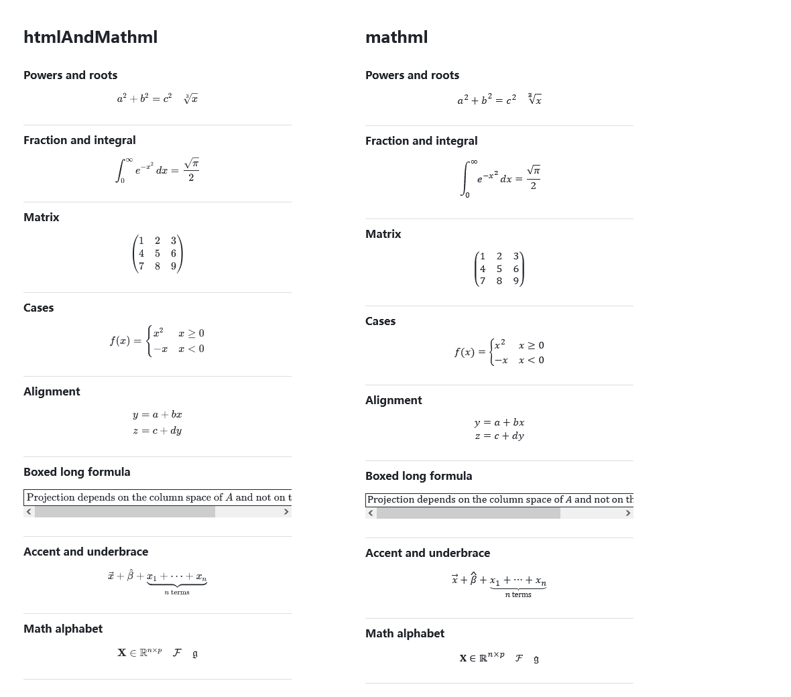

# Native MathML output experiment (2026-10-08)

## Decision

MathML-only is feasible on the tested Windows / Zotero 10.0.5 / Gecko 140.15.0 environment. It substantially reduces formula rendering work, generated markup, and retained preview allocations. Keep `htmlAndMathml` as the default while trying the experimental output: the Reader startup improvement is small and inconclusive, and native math changes some formula heights and typography.

## Experimental implementation

The experiment was developed on `qrkks/mathml-only-experiment`, based on `63cd4c9`, and integrated into `main` as an optional experimental setting. **Math rendering** in the preferences pane offers **KaTeX HTML + MathML (default)** and **Native MathML only (Experimental)**, backed by `extensions.annotationMarkdown.mathOutput`:

- `htmlAndMathml`: the existing output and the default.
- `mathml`: native MathML output; changes refresh open Readers.

The renderer preserves sanitized MathML `semantics` and TeX `annotation` elements so the source annotation does not become visible text. It restores the `.katex-display` wrapper for display formulas, selects the native `math` font family, and includes the output mode in the rendered-HTML cache. Outline labels retain native math while removing the duplicate TeX annotation from the cloned label; tooltips still contain the source TeX.

Both outputs retain the existing fonts and KaTeX bundle in this experimental XPI. This experiment measures runtime behavior, not another package-size optimization.

## Real annotation sample and renderer measurements

The development library contains a copied 423-annotation attachment, with 413 nonempty comments and 674,720 source characters. No annotation content was changed or exported into this report.

The current renderer was loaded into a separate sandbox and iframe inside Zotero's Reader. Each comment was rendered, sanitized, mounted into a 400 px wide expanded preview, and measured after forcing synchronous layout. The iframe was separate from the Reader's own annotation DOM. Each output ran three times, in the order HTML / MathML / MathML / HTML / HTML / MathML; the table gives medians.

| Metric | HTML + MathML | MathML-only | Reduction |
| --- | ---: | ---: | ---: |
| Total rendering and sanitization | 21.028 s | 7.856 s | 62.6% |
| Total DOM mounting and synchronous layout | 11.246 s | 5.360 s | 52.3% |
| Per-comment render + mount/layout P95 | 190 ms | 76 ms | 60.0% |
| Per-run longest comment, median | 623 ms | 224 ms | 64.0% |
| Generated markup characters | 23,254,508 | 6,245,585 | 73.1% |
| Cumulative generated DOM elements | 634,744 | 233,944 | 63.1% |
| Math elements | 13,344 | 13,344 | Unchanged |
| KaTeX error elements | 0 | 0 | Unchanged |

DOM counts are cumulative across individually mounted comments, not the number mounted together in a normal Reader. These timings exclude paint and full Reader startup. Equal formula counts and no parser errors do not establish visual equivalence for every formula.

## Actual Reader startup

The XPI was temporarily installed in the existing development profile. The copied attachment was closed and reopened for each of six interleaved runs. The start marker was immediately before `Zotero.Reader.open`; the first-preview marker was the first plugin preview found in the new Reader. A second marker waited two animation frames. These were warm-cache runs after an initial warmup open.

The fixed configuration was rendering enabled, math enabled, `renderStrategy=auto`, `nativeRowLazy=true`, and lightweight mode disabled.

| Metric | HTML + MathML | MathML-only |
| --- | ---: | ---: |
| First-preview median | 5.696 s | 5.461 s |
| First-preview range | 5.360–6.003 s | 5.213–5.474 s |
| Preview + two frames, median | 5.740 s | 5.506 s |

The approximately 4% median difference is within the overlapping observed ranges. Three runs per output do not establish a meaningful startup improvement. Layout and scheduling also differed: 250 ms after the first preview, HTML had three mounted previews while MathML had four, so later preview-node counts are not directly comparable.

## Retained memory probe

A separate stress probe retained the rendered-HTML cache and DOM for the 12 longest comments (77,658 source characters). It measured the entire Zotero process's `nsIMemoryReporterManager.heapAllocated` and resident memory before and after adding these previews. Each phase awaited `minimizeMemoryUsage` to complete; immediate synchronous GC readings were discarded because prior DOM cleanup had not completed.

Two measurements per output, in HTML / MathML / MathML / HTML order, gave:

| Increment over the cleaned baseline | HTML + MathML | MathML-only |
| --- | ---: | ---: |
| Allocated memory | 106.9 MiB | 37.8 MiB |
| Resident memory | 83.1 MiB | 27.2 MiB |
| Preview DOM elements | 69,306 | 25,840 |

Allocated memory was about 65% lower for this retained sample. These deltas are a controlled preview stress probe, not a prediction for total Zotero RAM or peak memory during ordinary use. The reported JS GC-heap capacity was unchanged and provides no additional conclusion.

## Native behavior and visual checks

Native Gecko checks passed for outline formulas and source tooltips, horizontal scrolling of long formulas, popup scrollbar interactions retaining the preview, formula glyph clicks entering the fast editor, and preserving the original Markdown draft.

A native screenshot compared powers, roots, fractions, integrals, matrices, cases, aligned equations, a long boxed formula, accents, underbraces, and mathematical alphabets. All displayed, and the long formula kept its own scrollbar. Typography differs: the tested integral display was approximately 62 px tall in MathML versus 38 px in HTML. Matrix and aligned-equation spacing also changed. Test further user formulas and supported operating systems before changing the default output.

The comparison uses synthetic formulas in the same native Gecko environment. Different row heights illustrate the layout tradeoff; it is not a pixel-equivalence test.

## Verification and cleanup

The test suite passed 25 files / 385 tests, including new sanitizer, cache-switch, outline, glyph-click, scrollbar, preference-default, and observer-cleanup regressions. Type checking, bilingual documentation checks, build/package checks, and XPI inspection passed.

The development profile's original installed XPI was restored byte-for-byte, the experimental user/default preference was removed, the original Reader tab was restored, and the probe iframe and sandbox were removed. The published `updates.json` and version 0.11.1 were preserved. No push, tag, or release was performed.

Raw aggregate measurements and the synthetic comparison screenshot remain in the ignored `.tmp/mathml-experiment/` directory. The trial XPI is in `output/zotero-annotation-markdown-0.11.1-mathml-experiment.xpi`.

## Follow-up: delayed popup scroll reset

A user reported that a wide formula in a popup returned to the left shortly after dragging to the right. The previous `08fe6a9` fix still protects popup scrollbar events from entering edit mode. A separate delayed-render path remained: `applyRenderedHtml` compared the live preview's serialized DOM with the renderer's HTML string. A focus or decorating attribute could make them unequal, so a later scan replaced the formula DOM and reset its native scroll position even though the rendered content had not changed.

The adapter now remembers the last renderer HTML for each preview in a WeakMap. Unchanged output preserves the existing DOM and scrolling. Changed output, released previews, empty previews, and cleanup still refresh or discard the stored state as appropriate.

The regression uses the supplied boxed Chinese formula about z standardization. In a separate native Gecko fixture with the same effective 160% font size, introducing a `tabindex` attribute and forcing another render changed `scrollLeft` from 219 to 0 with the previous implementation. The updated implementation kept the same scroller at 219 through immediate and delayed renders. This follow-up used Zotero 10.0.6 / Gecko 140.17.0. The test explicitly introduced the focus attribute; the trigger in the user's original popup was not captured.

The full suite now passes 25 files / 387 tests, including release/restoration of previews and right-end MathML scrolling with the supplied formula. Type checking, documentation checks, build/package checks, and whitespace checks passed. Native results are in `.tmp/mathml-experiment/popup-scroll-regression.json`; the updated local trial is `output/zotero-annotation-markdown-0.11.1-mathml-scroll-fix.xpi`.

The user confirmed that the fixed trial stopped the delayed scroll reset in the reported popup.

## Preferences pane and main-branch integration

The native XUL preferences pane now exposes the output choice below **Render LaTeX math formulas**. Standard rendering remains the default; the picker is disabled while Markdown or LaTeX rendering is off without losing the selected output. English and Chinese README highlights, user guides, and release notes describe the option and its layout differences.

Native pane testing found an additional live-switch issue: the viewport and idle scheduling paths skipped already mounted previews before checking their cached output mode. The controller now records the math settings of each mounted preview independently of the HTML cache. A change to math output or enabled state makes the preview eligible for rendering again; unchanged settings preserve the existing DOM. Six regression cases cover automatic, eager, and lazy strategies, with and without idle callbacks, including previews whose HTML exceeds the cache budget.

On Zotero 10.0.6 / Gecko 140.17.0, actual XUL menu commands switched an already open fixture Reader between standard output (three `.katex-html` elements) and native MathML (zero `.katex-html`, three MathML semantics/TeX annotations). Disabling and reenabling math or Markdown updated the Reader and the picker's disabled state. Returning to standard restored all three HTML formulas, and the source comments remained identical. The native preferences layout was checked visually. Raw state counts are in `.tmp/mathml-experiment/preferences-pane-verification.json`.

The final integration verification passed 25 files / 396 tests, type checking, bilingual documentation checks, build/package checks, and whitespace checks. Those integration trials used version 0.11.1 while preserving its published update manifest. The local preferences-pane trial was `output/zotero-annotation-markdown-0.11.1-mathml-option.xpi`; no remote push, tag, or release was performed at that stage. Version 0.12.0 includes the output picker as an optional experimental setting, with standard output still the default.

The exact 0.12.0 release-candidate XPI also passed a native Zotero 10.0.6 smoke test: actual preference-menu commands changed the open fixture Reader from three HTML formulas to three native MathML formulas and back, retaining both display wrappers and identical source comments. The development profile's original XPI and preferences were restored afterward.
