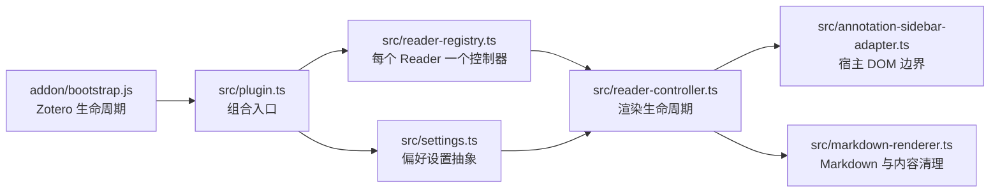
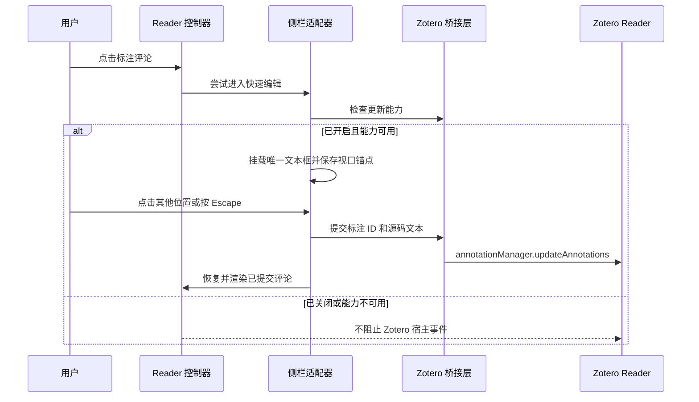

# 架构与文件职责

[English](../en/architecture.md)

本文说明仓库的当前结构和仍在使用的开发边界。

## 运行流程



`addon/bootstrap.js` 由 Zotero 直接执行。它加载打包后的 `plugin.js`、注册偏好设置面板、读取样式，并负责诊断日志初始化。`src/plugin.ts` 是组合入口：把 Zotero API 与设置、渲染器、DOM 适配器、每个 Reader 的控制器和注册表连接起来。

控制器负责发现标注评论并决定何时渲染。适配器是唯一应该直接操作 Zotero 标注 DOM 的模块。渲染器只接收文本并返回经过清理的 HTML，不感知 Reader 节点或偏好设置。

## 快速编辑器流程

只有偏好设置已开启，并且当前 Reader 暴露了可调用的标注更新管理器时，快速编辑器才会替代 Zotero 原生标注评论编辑器：



`src/plugin.ts` 是半内部标注管理器和可选删除键保护的宿主桥接层。`src/reader-controller.ts` 协调捕获阶段的进入和退出事件，但不持有编辑器 DOM。`src/annotation-sidebar-adapter.ts` 负责文本框、草稿会话、失焦或 Escape 保存、视口锚定和清理。如果缺少更新能力，适配器不会挂载快速编辑器，也不会阻止 Zotero 的事件。

## 性能依据与边界

观察到的问题取决于具体工作负载：在一本真实的重度标注书籍中，使用 Zotero 原生编辑器时编辑明显变慢，启用替代编辑器后同一本书又恢复流畅。该现象与侧栏中大量标注行和标签相关。这组 A/B 结果足以支持绕过原生编辑 UI，但不能证明标签是唯一原因，也不能据此指定 Zotero 内部某个确切瓶颈。

替代编辑器通过以下方式减少输入路径上的工作：只保留一个普通文本框会话，让无关预览 DOM 继续挂载，暂停插件渲染观察，并在失焦或按 Escape 时只提交一次最终源码。持久化仍调用 Zotero 自己使用的 Reader 标注管理器；提交成功后，控制器只协调并渲染受影响的评论。视口锚定只补偿已经可见的编辑器打开时产生的布局移动。

这项优化不会替换 Zotero 的标注存储，不会普遍加速标签管理，也不会改变 PDF 页面渲染器。它依赖半内部 Reader 集成，因此必须同时保留能力检测和由用户控制的原生编辑器回退。

## 快速编辑器实现索引

| 关注点 | 主要符号 | 契约 |
| --- | --- | --- |
| 宿主能力与持久化 | `src/plugin.ts` 中的 `canUseReaderFastEditor()`、`commitReaderAnnotationComment()` | 接管前检测可调用的 Reader 标注管理器；必要时复制跨 compartment 更新数据；提交失败时不丢弃草稿。 |
| Reader 键盘安全 | `src/plugin.ts` 中的 `beginReaderFastEditorKeyboardGuard()`，以及适配器捕获的编辑器事件 | 能力可用时临时关闭 Zotero 的空评论删除快捷逻辑，并阻止文字编辑按键到达 Reader 层处理器。 |
| 进入与退出协调 | `src/reader-controller.ts` 中的 `registerFastEditorHandlers()`、`scheduleFastEditorAfterNativeFocus()`、`scheduleEditingResume()` | 从指针事件尽早进入；焦点触发时等待 Zotero 状态稳定；在外部焦点或窗口失焦时关闭；只恢复刚刚编辑的评论。 |
| 编辑器 DOM 与草稿所有权 | `src/annotation-sidebar-adapter.ts` 中的 `showFastEditor()`、`closeFastEditor()`、`FastEditorSession`、`fastEditorSessionByDocument` | 每个文档只持有一个文本框会话；Zotero 移除宿主 DOM 时仍保留已修改草稿；只有提交成功后才关闭。 |
| 提交通知 | `FAST_EDITOR_CLOSED_EVENT` 和 `FastEditorClosedDetail` | 把标注 ID、已提交源码和提交状态传回控制器；即使原标注行已经脱离 DOM 也能通知。 |
| 视口稳定 | `captureFastEditorViewportAnchor()` 和 `restoreFastEditorViewportAnchor()` | 只锚定已经与真实可滚动侧栏相交的标注，并修正 Gecko 可能在下一帧产生的焦点移动。 |
| 原生回退 | 传给适配器的 `isFastEditorEnabled()` 与能力检查 | 偏好设置关闭或缺少所需管理器时，不挂载插件编辑器 DOM，也不阻止宿主事件。 |

对应的回归测试位于 `tests/plugin.test.js`、`tests/reader-controller.test.js`、`tests/annotation-sidebar-adapter.test.js` 和 `tests/rendered-content-style.test.js`。任何生命周期修改都应先在最窄的适用测试中复现准确的 DOM、焦点、键盘、保存或滚动失败场景。

## 侧栏滚动与标注选中状态

`getSelectedAnnotationScrollbar()` 为已选中、非编辑状态的标注复用编辑器的滚动容器与滚动条命中判断。`registerAnnotationScrollbarHandlers()` 跟踪该指针交互，直到释放或取消。在此期间，只拦截目标为滚动容器或其祖先的 `focusin`，避免 Zotero 冒泡阶段的 `FocusManager` 清除选中状态。原生指针事件不被取消；这条路径不会重新选中标注、恢复标注焦点，也不会调用滚动 API。

选中与展开状态仍由宿主持有，包括多选。键盘输入、新的外部指针操作、焦点进入真实控件或另一条标注、刷新与关闭都会清除临时保护。原生笔记编辑器和标注弹窗被排除；活跃快速编辑会话沿用已有的失焦保护路径。`tests/annotation-scrollbar.test.js` 按本机安装的 Reader 取消选中规则建模，覆盖持续拖动、覆盖式滚动条、清理和正常选中切换。真实 Zotero 验证还应确认：把一条很长的已选中标注滚出视野再滚回来，不会使它折叠，也不会把视口拉回该标注。

## 第三方 Reader 插件互操作

标注卡片和 `.comment` 容器仍归 Zotero 所有，但可见的评论正文不一定是 Zotero 原生展示。本插件保留 Zotero 的 `.content` 作为源码，并添加同级 `.annotation-markdown-rendered`；Weavero 也可以独立添加同级 `.wv-md-preview`。每个插件只能修改和移除自己的预览节点。

快速编辑会间接影响这条展示边界。触发 `annotation-markdown-fast-editor-closed` 后，控制器通过 `handleCommentNodes([comment], { force: true })` 恢复渲染。因此，即使替代编辑器本身只持有一个文本框，编辑后的评论也可能重新切换为本插件的预览。插件间 MutationObserver 的执行顺序不是互操作契约，不能用它决定切换后保留哪一方的行为或样式。

当前 Weavero 桥接采用明确入口，并为各层保留独立回退：

| 关注点 | 互操作契约 |
| --- | --- |
| 源码所有权 | Zotero 的 `.content` 始终作为共享源码边界保留；两个插件都不应向其中注入格式化链接节点。 |
| 预览所有权 | 本插件拥有 `[data-annotation-markdown-preview="true"]`；Weavero 拥有 `.wv-md-preview`。清理必须限制在各自拥有的节点内。 |
| Zotero 链接行为 | 支持的 `zotero://select`、`zotero://open`、`zotero://open-pdf` 和 `zotero://note` 链接，在能力可用时优先调用 `Zotero.Weavero.plugin.handleZoteroURI()`，否则回退 `Zotero.launchURL()`。 |
| 链接颜色 | Weavero 可用且其 `recolorAmLinks` 颜色设置开启时，本插件预览分别用 `--wv-link-http`、`--wv-link-zotero` 和 `--wv-link-app` 为 HTTP(S)、Zotero 与其他链接配色。关闭该设置后，链接使用 Zotero 的 `LinkText`；缺少 Weavero 变量时也会回退到 `LinkText`。 |
| 事件顺序 | 渲染链接的主指针/鼠标事件会在 Zotero 的标注行选择路径替换预览或进入编辑前停止。其他插件应使用明确的行为桥接，而不是依赖观察器时序。 |

新增其他 Reader 集成时，行为优先使用可调用的宿主或插件 API，主题值优先使用带命名空间的 CSS 自定义属性。不要复制其他插件的固定颜色、修改其预览 DOM，或根据最后运行的观察器推断所有权。

## 运行时约束

- Zotero 原始标注源码始终保留在宿主 DOM 中。插件只添加带标记的同级预览节点，并在关闭时移除自己的节点。
- 标注编辑器拥有焦点时暂停渲染；编辑结束后，只强制立即渲染刚刚编辑的评论。
- 每个 Reader 文档最多存在一个快速编辑会话。只要草稿发生变化，就必须在关闭编辑器前提交；即使 Zotero 在失焦事件到达前替换宿主 DOM，也要保留并提交草稿。
- 快速编辑器的键盘事件必须留在文本框内，避免 Backspace、Delete 和方向键触发 Reader 层面的标注操作。
- 关闭偏好设置或缺少必要的标注更新能力时，由 Zotero 原生编辑器继续接管。
- 每个打开的 Reader 最多只有一个控制器；即使启动是异步的，注册和关闭顺序也必须安全。
- 禁用 Markdown 原始 HTML，并由 DOMPurify 对最终生成的 HTML 做最后清理。
- 懒渲染限制视口附近和空闲时段内的工作量；性能诊断默认关闭。
- Zotero 窗口关闭后可能留下失效的宿主对象，因此关闭流程按操作和 Reader 根节点分别做尽力清理。

## 源码文件

| 文件 | 职责 |
| --- | --- |
| `src/plugin.ts` | 插件组合入口和 Zotero 启动/关闭集成；注册 Reader 事件与偏好设置观察器，检测快速编辑能力，把提交桥接到 Zotero 标注管理器，并在 Weavero 可用时委托受支持的 Zotero 链接。 |
| `src/reader-registry.ts` | 每个 Reader 持有一个控制器，避免重复注册，并协调异步启动和停止。 |
| `src/reader-controller.ts` | 协调 Reader 就绪、DOM 扫描、立即/懒渲染、快速编辑进入/退出事件、编辑暂停、缓存、诊断、样式和清理。 |
| `src/annotation-sidebar-adapter.ts` | 封装 Zotero Reader 选择器、“源码 + 预览”DOM 操作和快速文本框会话，并排除原生笔记编辑器。 |
| `src/markdown-renderer.ts` | 规范化标注文本，渲染 Markdown 和可选数学公式，清理输出，并提供纯文本回退。 |
| `src/settings.ts` | 定义偏好键、默认值、规范化规则，以及运行模块使用的设置 API。 |
| `src/types.ts` | 保存不依赖 Zotero 宿主对象形状的小型共享契约。 |
| `src/markdown-it-texmath.d.ts` | 提供 `markdown-it-texmath` 所需的最小本地 TypeScript 声明。 |

Zotero 特有的对象形状应保留在实际使用它们的边界附近，不要扩展成宽泛的全局类型。

## 插件运行文件

| 文件 | 职责 |
| --- | --- |
| `addon/bootstrap.js` | Zotero 直接调用的生命周期入口；加载打包代码、注册设置面板、读取 CSS 并轮转诊断日志。 |
| `addon/manifest.json` | 插件标识、版本、Zotero 兼容范围、图标和更新地址。 |
| `addon/prefs.js` | Zotero 加载的默认偏好设置值。 |
| `addon/preferences.xhtml` | 偏好设置面板结构。 |
| `addon/preferences.js` | 偏好设置面板事件处理，并写入 `Zotero.Prefs`。 |
| `addon/preferences.css` | 偏好设置面板布局样式。 |
| `addon/styles/annotation-markdown.css` | Reader 预览、折叠、编辑、链接、代码和内容可见性样式，包括受偏好开关控制的 Weavero 链接颜色变量。 |
| `addon/icons/annotation-markdown.svg` | 插件和偏好设置面板图标。 |

这些 JavaScript 文件有意保留为 JavaScript，因为 Zotero 会直接执行它们。`src/` 下的 TypeScript 会被打包为 `dist/addon/plugin.js`。

## 构建与维护脚本

| 文件 | 职责 |
| --- | --- |
| `scripts/build.mjs` | 复制 `addon/`、打包 `src/plugin.ts`，并准备插件 CSS 和 KaTeX 资源。 |
| `scripts/katex-assets.mjs` | 内联生成 CSS 引用的 KaTeX WOFF2 字体数据。 |
| `scripts/package.mjs` | 创建可复现的 XPI，并生成本地更新元数据。 |
| `scripts/release-config.mjs` | 集中管理发布文件名、更新地址、可复现 ZIP 元数据和更新清单结构。 |
| `scripts/check-docs.mjs` | 检查中英文页面是否成对，并验证本地 Markdown 链接。 |
| `scripts/read-debug-log.mjs` | 从 Zotero 配置中读取按需启用的标注 Markdown 诊断日志。 |

`pnpm run package` 会根据本地构建的 XPI 重写 `updates.json`。只有正式发布时才保留该哈希；普通本地验证后应恢复已发布版本的元数据。

## 测试

| 测试文件 | 主要覆盖范围 |
| --- | --- |
| `tests/plugin.test.js` | 插件组合、Reader 事件、偏好设置、快速编辑宿主能力与提交桥接，以及关闭。 |
| `tests/reader-registry.test.js` | 控制器所有权和异步生命周期顺序。 |
| `tests/reader-controller.test.js` | 渲染策略、观察器、快速编辑事件生命周期、编辑暂停、缓存、诊断和清理。 |
| `tests/annotation-sidebar-adapter.test.js` | Zotero DOM 选择、源码提取、预览/编辑行为、快速编辑保存与视口行为，以及旧状态清理。 |
| `tests/annotation-scrollbar.test.js` | 已选中标注的滚动条焦点、持续拖动、视口与预览保持，以及交互保护清理。 |
| `tests/markdown-renderer.test.js` | Markdown、数学公式、内容清理、文本规范化和回退行为。 |
| `tests/settings.test.js` | 偏好默认值和规范化。 |
| `tests/bootstrap.test.js` | Zotero 启动集成和诊断。 |
| `tests/preferences-pane.test.js` | 偏好设置面板绑定。 |
| `tests/rendered-content-style.test.js` | 预览折叠、编辑状态和性能相关 CSS。 |
| `tests/katex-assets.test.js` | KaTeX 字体内联。 |
| `tests/release-config.test.js` | 更新清单和可复现打包配置。 |
| `tests/manifest.test.js` | 清单标识与兼容范围。 |
| `tests/version.test.js` | 各发布文件之间的版本一致性。 |

测试继续使用 JavaScript，以便用轻量的 Zotero 局部 Mock 验证面向运行时的 TypeScript 契约。

## 构建产物

`pnpm run build` 创建 `dist/addon/`，并把 TypeScript 依赖图打包为 `dist/addon/plugin.js`。`pnpm run package` 创建 `dist/zotero-annotation-markdown.xpi`。`dist/` 是生成目录；应修改 `src/`、`addon/` 或 `scripts/` 中的源文件。

发布前运行完整验证：

```powershell
pnpm run verify
```
