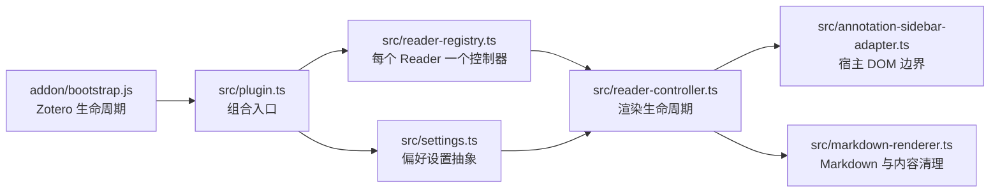

# 架构与文件职责

[English](../en/architecture.md)

本文说明仓库的当前结构和仍在使用的开发边界。

## 运行流程



`addon/bootstrap.js` 由 Zotero 直接执行。它加载打包后的 `plugin.js`、注册偏好设置面板、读取样式，并负责诊断日志初始化。`src/plugin.ts` 是组合入口：把 Zotero API 与设置、渲染器、DOM 适配器、每个 Reader 的控制器和注册表连接起来。

控制器负责发现标注评论并决定何时渲染。适配器是唯一应该直接操作 Zotero 标注 DOM 的模块。渲染器只接收文本并返回经过清理的 HTML，不感知 Reader 节点或偏好设置。

## 运行时约束

- Zotero 原始标注源码始终保留在宿主 DOM 中。插件只添加带标记的同级预览节点，并在关闭时移除自己的节点。
- 标注编辑器拥有焦点时暂停渲染；编辑结束后，只强制立即渲染刚刚编辑的评论。
- 每个打开的 Reader 最多只有一个控制器；即使启动是异步的，注册和关闭顺序也必须安全。
- 禁用 Markdown 原始 HTML，并由 DOMPurify 对最终生成的 HTML 做最后清理。
- 懒渲染限制视口附近和空闲时段内的工作量；性能诊断默认关闭。
- Zotero 窗口关闭后可能留下失效的宿主对象，因此关闭流程按操作和 Reader 根节点分别做尽力清理。

## 源码文件

| 文件 | 职责 |
| --- | --- |
| `src/plugin.ts` | 插件组合入口和 Zotero 启动/关闭集成；注册 Reader 事件与偏好设置观察器。 |
| `src/reader-registry.ts` | 每个 Reader 持有一个控制器，避免重复注册，并协调异步启动和停止。 |
| `src/reader-controller.ts` | 协调 Reader 就绪、DOM 扫描、立即/懒渲染、编辑暂停、缓存、诊断、样式和清理。 |
| `src/annotation-sidebar-adapter.ts` | 封装 Zotero Reader 选择器和“源码 + 预览”DOM 操作，并排除原生笔记编辑器。 |
| `src/markdown-renderer.ts` | 规范化标注文本，渲染 Markdown 和可选数学公式，清理输出，并提供纯文本回退。 |
| `src/settings.ts` | 定义偏好键、默认值、规范化规则，以及运行模块使用的设置 API。 |
| `src/types.ts` | 保存不依赖 Zotero 宿主对象形状的小型共享契约。 |
| `src/markdown-it-texmath.d.ts` | 提供 `markdown-it-texmath` 所需的最小本地 TypeScript 声明。 |

Zotero 特有的对象形状应保留在实际使用它们的边界附近，不要扩展成宽泛的全局类型。

## 插件运行文件

| 文件 | 职责 |
| --- | --- |
| `addon/bootstrap.js` | Zotero 直接调用的生命周期入口；加载打包代码、注册设置面板、读取 CSS 并轮转诊断日志。 |
| `addon/manifest.json` | 插件标识、版本、Zotero 兼容范围、图标和更新地址。 |
| `addon/prefs.js` | Zotero 加载的默认偏好设置值。 |
| `addon/preferences.xhtml` | 偏好设置面板结构。 |
| `addon/preferences.js` | 偏好设置面板事件处理，并写入 `Zotero.Prefs`。 |
| `addon/preferences.css` | 偏好设置面板布局样式。 |
| `addon/styles/annotation-markdown.css` | Reader 预览、折叠、编辑、链接、代码和内容可见性样式。 |
| `addon/icons/annotation-markdown.svg` | 插件和偏好设置面板图标。 |

这些 JavaScript 文件有意保留为 JavaScript，因为 Zotero 会直接执行它们。`src/` 下的 TypeScript 会被打包为 `dist/addon/plugin.js`。

## 构建与维护脚本

| 文件 | 职责 |
| --- | --- |
| `scripts/build.mjs` | 复制 `addon/`、打包 `src/plugin.ts`，并准备插件 CSS 和 KaTeX 资源。 |
| `scripts/katex-assets.mjs` | 内联生成 CSS 引用的 KaTeX WOFF2 字体数据。 |
| `scripts/package.mjs` | 创建可复现的 XPI，并生成本地更新元数据。 |
| `scripts/release-config.mjs` | 集中管理发布文件名、更新地址、可复现 ZIP 元数据和更新清单结构。 |
| `scripts/check-docs.mjs` | 检查中英文页面是否成对，并验证本地 Markdown 链接。 |
| `scripts/read-debug-log.mjs` | 从 Zotero 配置中读取按需启用的标注 Markdown 诊断日志。 |

`pnpm run package` 会根据本地构建的 XPI 重写 `updates.json`。只有正式发布时才保留该哈希；普通本地验证后应恢复已发布版本的元数据。

## 测试

| 测试文件 | 主要覆盖范围 |
| --- | --- |
| `tests/plugin.test.js` | 插件组合、Reader 事件、偏好设置和关闭。 |
| `tests/reader-registry.test.js` | 控制器所有权和异步生命周期顺序。 |
| `tests/reader-controller.test.js` | 渲染策略、观察器、编辑暂停、缓存、诊断和清理。 |
| `tests/annotation-sidebar-adapter.test.js` | Zotero DOM 选择、源码提取、预览/编辑行为和旧状态清理。 |
| `tests/markdown-renderer.test.js` | Markdown、数学公式、内容清理、文本规范化和回退行为。 |
| `tests/settings.test.js` | 偏好默认值和规范化。 |
| `tests/bootstrap.test.js` | Zotero 启动集成和诊断。 |
| `tests/preferences-pane.test.js` | 偏好设置面板绑定。 |
| `tests/rendered-content-style.test.js` | 预览折叠、编辑状态和性能相关 CSS。 |
| `tests/katex-assets.test.js` | KaTeX 字体内联。 |
| `tests/release-config.test.js` | 更新清单和可复现打包配置。 |
| `tests/manifest.test.js` | 清单标识与兼容范围。 |
| `tests/version.test.js` | 各发布文件之间的版本一致性。 |

测试继续使用 JavaScript，以便用轻量的 Zotero 局部 Mock 验证面向运行时的 TypeScript 契约。

## 构建产物

`pnpm run build` 创建 `dist/addon/`，并把 TypeScript 依赖图打包为 `dist/addon/plugin.js`。`pnpm run package` 创建 `dist/zotero-annotation-markdown.xpi`。`dist/` 是生成目录；应修改 `src/`、`addon/` 或 `scripts/` 中的源文件。

发布前运行完整验证：

```powershell
pnpm run verify
```
